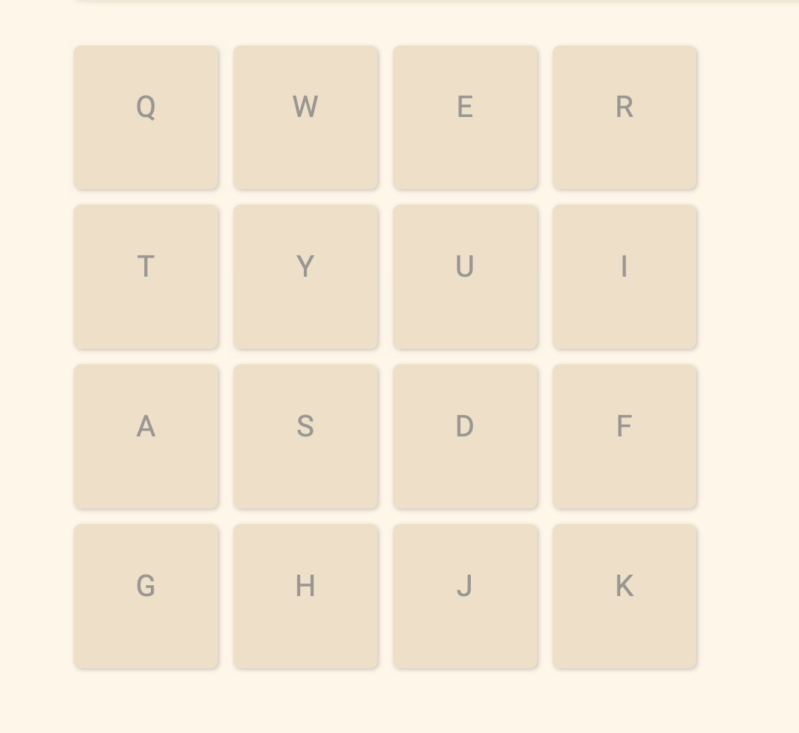
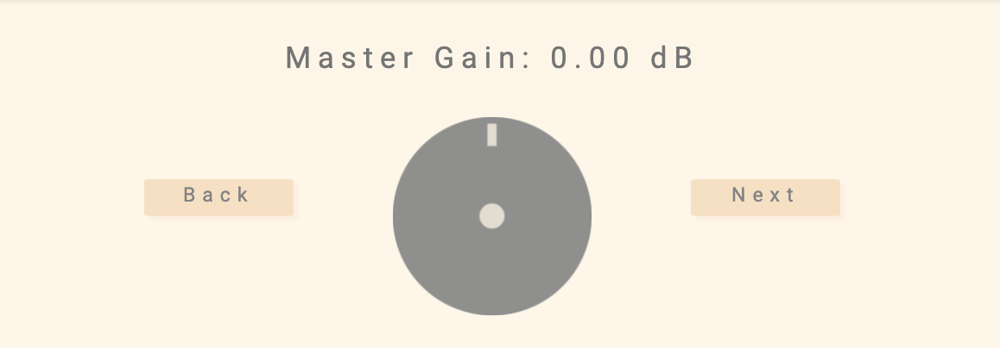
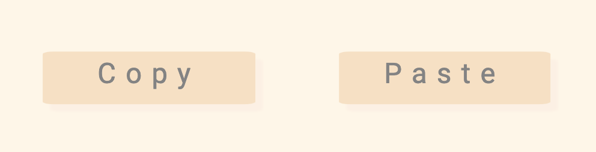
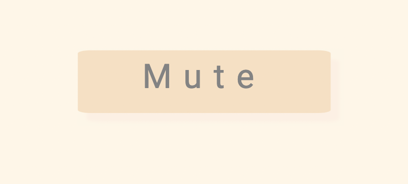
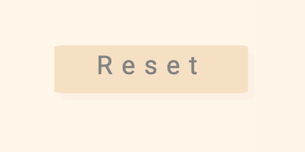
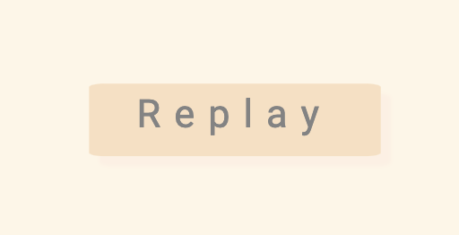
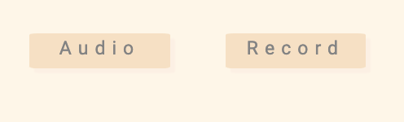
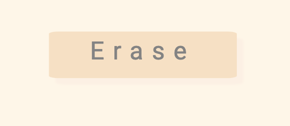
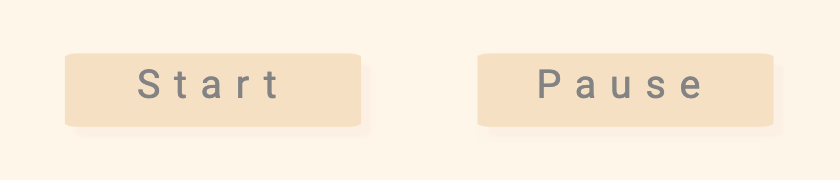

# How to use Samplify

- In order to attatch a file to a pad, click on the pad and select the audio file

- In order to play the sounds stored the pad, type the letter of the pad on the key - For example, if you added a file to the pad labeled 'Q', in order to play the file, type 'q' on your computer

- To select a pad, right click on the pad

- You can navigate through various effects using the "Next" and the "Back" button (as well as the left arrow key and the right arrow key)

- You can change the value of the effects through the knob - Drag the knob upward to increase the value, downward to decrease the value

- When you press the "Copy" button, it will copy the audio file of the selected pad

- When you press the "Paste" button, it will paste the audio file of the copied pad

- Clicking on the "Mute" button will mute the selected pad, and in order to unmute the pad, click it again

- Clicking on the "Reset" button will reset all the effects of the current pad

- Clicking on the "Replay" button will toggle on replay for the current pad

- The "Record" button will record either the microphone or the master output (of Samplify) depending on the value of the "Audio" button

- Clicking on the "Audio" button will change the source of the recording to the master output of Samplify, it will change the "Audio" button to a "Track" button. Clicking on it again will change the source back to the microphone

- Clicking on the "Erase" button erase all the audio data of the selected pad

- Clicking on the Start button will start the audio of the selected pad

- Clicking on the Pause button will pause the audio of the selected pad
